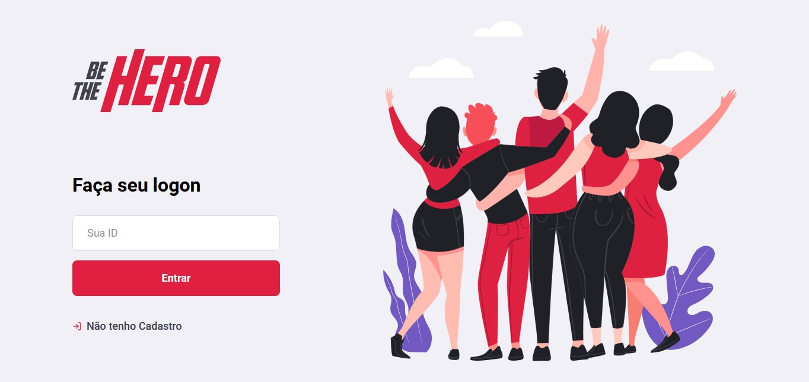
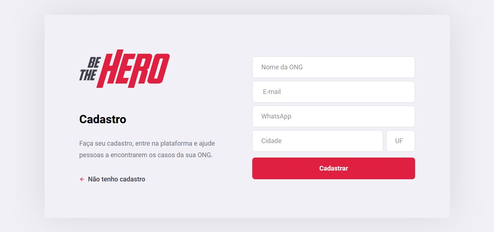
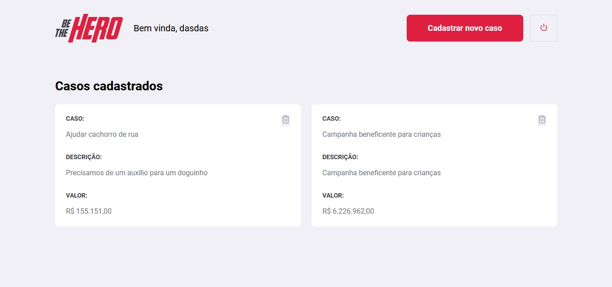
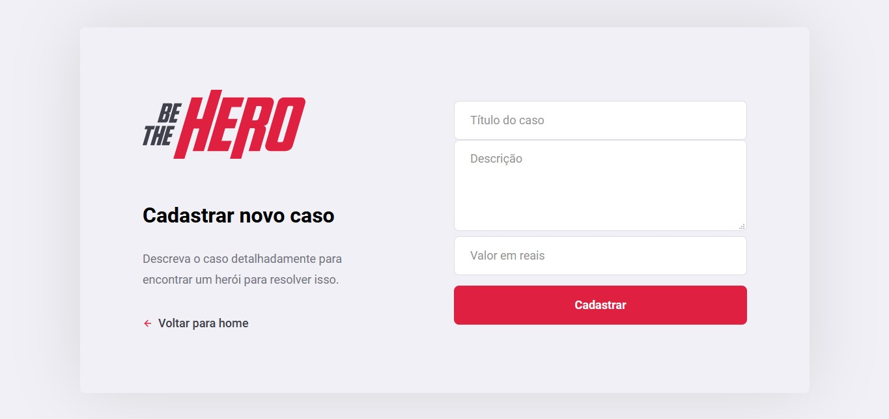

# Be The Hero

### _Be The Hero_ - Application for ONGs

## Built with:
- ReactJs
- React-router-dom
- Styled-components
- A lot of coffee :)

## Instructions
- Open your terminal.
- Insert `git clone https://github.com/folfer/BE-THE-HERO.git`
- Insert `cd be-the-hero`
- if you don't have nodeJS on your device, install https://nodejs.org/en/download/
- Insert the `yarn` to install all dependencies.
- Insert `npm start` to run.

## Preview

  
  
  
  

